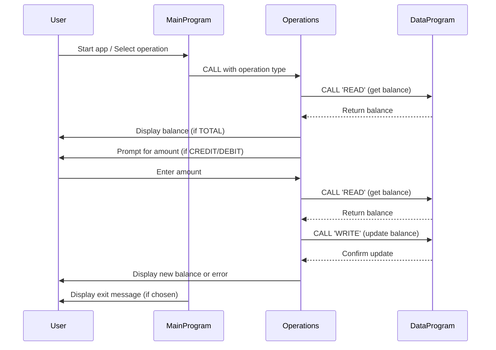

# COBOL Student Account Management System

This project demonstrates a simple student account management system written in COBOL. The system allows users to view account balances, credit accounts, and debit accounts, with basic business rules enforced for student accounts.

## Purpose of Each COBOL File

### `main.cob`
**Purpose:**
- Entry point for the application.
- Presents a menu to the user for account operations: View Balance, Credit Account, Debit Account, and Exit.
- Handles user input and delegates operations to the `operations.cob` program.

**Key Functions:**
- Menu display and user interaction loop.
- Calls the `Operations` program with the selected operation type.

**Business Rules:**
- Only allows valid choices (1-4).
- Exits cleanly when the user selects Exit.

---

### `operations.cob`
**Purpose:**
- Implements the logic for each account operation: viewing balance, crediting, and debiting.
- Interacts with the `data.cob` program to read and update the account balance.

**Key Functions:**
- Handles three operations: `TOTAL` (view balance), `CREDIT` (add funds), and `DEBIT` (subtract funds).
- Prompts the user for amounts when crediting or debiting.
- Ensures sufficient funds before allowing a debit.
- Updates the balance after credit or debit operations.

**Business Rules:**
- Prevents debiting more than the available balance (no overdraft).
- Displays appropriate messages for successful transactions or errors (e.g., insufficient funds).

---

### `data.cob`
**Purpose:**
- Manages persistent storage of the account balance.
- Provides read and write operations for the balance.

**Key Functions:**
- Responds to `READ` requests by returning the current balance.
- Responds to `WRITE` requests by updating the stored balance.

**Business Rules:**
- Initializes the account balance to 1000.00 by default.
- Ensures that all updates to the balance are consistent and atomic.

---

## Specific Business Rules for Student Accounts
- **No overdraft allowed:** Debit operations are only permitted if the account has sufficient funds.
- **Initial balance:** Each account starts with a balance of 1000.00.
- **Atomic updates:** All changes to the balance are performed through the `data.cob` program to ensure consistency.

---

## Sequence Diagram: Student Account Management System

For further details, see the source code in the `src/cobol/` directory.
